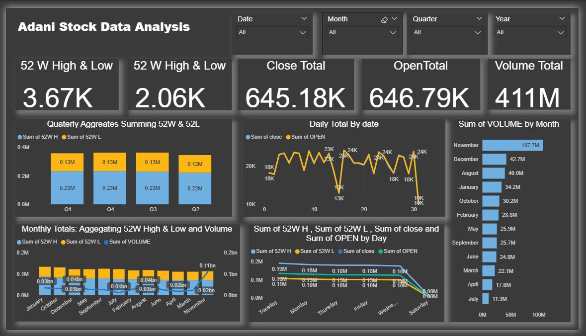
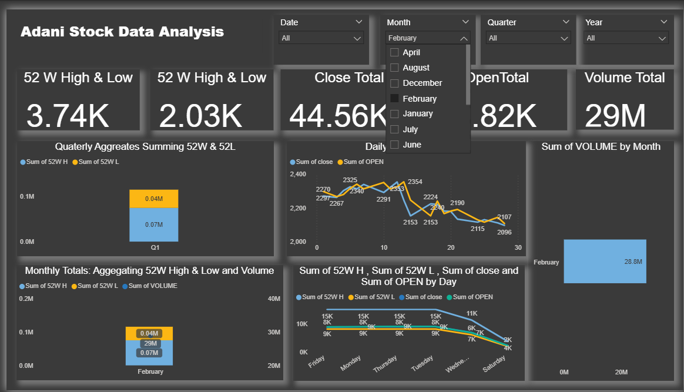
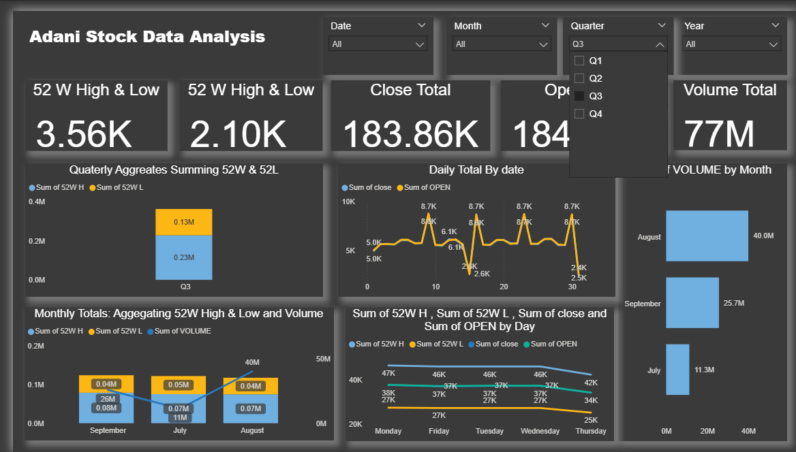
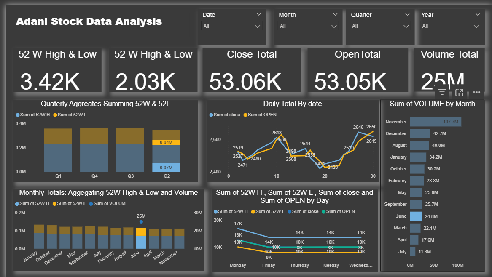

# 📊 Adani Stock Data Analysis

This project provides an **interactive Power BI dashboard** to analyze Adani stock market trends over various time frames. It visualizes **52-week highs & lows**, trading volumes, open/close prices, and aggregated data across **months and quarters**.

---

## 📁 Project Overview

The goal of this project is to:
- Track **Adani stock performance** over different periods.
- Compare **52W High** and **52W Low** values.
- Identify trends in **daily open & close prices**.
- Analyze **trading volumes** by month and quarter.
- Provide interactive filtering for **Date, Month, Quarter, and Year**.

---

## 📷 Dashboard Preview

### **Home View (All Data)**

### **Monthly Filter - February Example**

### **Quarterly Filter - Q3 Example**

### **Volume Analysis**

---

## 📊 Dashboard Features

### **KPIs (Key Performance Indicators)**
- **52W High & Low**: Shows the peak and bottom prices in the last 52 weeks.
- **Close Total**: Aggregated closing prices.
- **Open Total**: Aggregated opening prices.
- **Volume Total**: Total traded volume.

### **Visualizations**
1. **Quarterly Aggregates** – Summarizing 52W High & Low values.
2. **Daily Trends** – Comparison of daily open vs close prices.
3. **Monthly Aggregates** – 52W High, 52W Low, and Volume totals per month.
4. **Volume by Month** – Ranking months by total traded volume.
5. **Open/Close & 52W by Day** – Weekday patterns in stock movement.

---

## 🛠 Tools & Technologies
- **Power BI** – Dashboard creation & visualization.
- **Excel / CSV Dataset** – Historical stock data source.
- **Stock Data API / NSE Data** – For fetching real-time or historical stock prices.

---

## 📂 Dataset
- **Columns**: Date, Open, Close, High, Low, Volume, 52W High, 52W Low, etc.
- **Source**: Public stock market data for Adani companies.
- **Time Period**: Multiple months covering an entire year.

---

## 🚀 How to Use
1. Open the `.pbix` file in **Power BI Desktop**.
2. Use the **filters** (Date, Month, Quarter, Year) to explore different views.
3. Analyze trends and identify stock market patterns.
4. Export visual insights for reporting or presentations.

---

## 📈 Insights Gained
- **February** had a traded volume of **28.8M**.
- **November** recorded the **highest trading volume** at **107.7M**.
- Stock prices show **weekday patterns** with peaks on certain days.
- Quarterly analysis reveals **price stability and variations** over the year.

---

## 📜 License
This project is licensed under the **MIT License** – feel free to use and modify.

---

## 👤 Author
**Mayank Singh**  
GitHub: [mayanksingh1111](https://github.com/mayanksingh1111)
